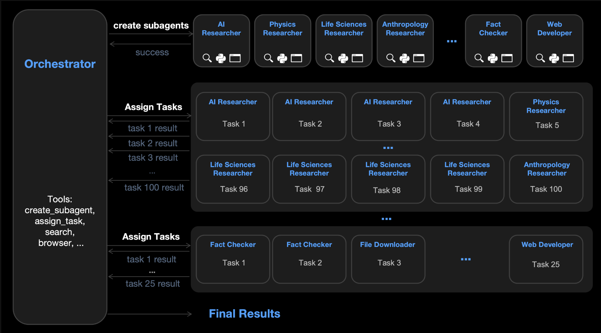

# strands-swarms

[](https://github.com/JackXu0/strands-swarms/actions/workflows/ci.yml)
[](https://pypi.org/project/strands-swarms/)
[](https://opensource.org/licenses/Apache-2.0)

**Turn natural language into multi-agent workflows — automatically.**

Give `DynamicSwarm` a query, and it automatically plans the workflow, spawns specialized agents, and executes tasks with dependencies. No manual graph configuration or agent wiring required.

```python
swarm = DynamicSwarm(available_tools={...}, available_models={...})
result = swarm.execute("Research AI trends and write a summary report")
# → Spawns researcher + writer agents, handles dependencies, returns final report
```

## Inspiration

This project is inspired by [Kimi K2.5's Agent Swarm](https://www.kimi.com/blog/kimi-k2-5.html) — where a trainable orchestrator dynamically creates and coordinates sub-agents without predefined roles or workflows. The goal is to build an open-source foundation for training orchestrators that can spin up agent swarms on the fly.

## How It Works



## Installation

```bash
pip install strands-swarms
```

## Quick Start

```python
from strands import tool
from strands.models import BedrockModel
from strands_swarms import DynamicSwarm

# Define your tools
@tool
def search_web(query: str) -> str:
    """Search the web for information."""
    return f"[Search Results for '{query}']\n- Result 1: Latest developments..."

@tool
def analyze_data(data: str) -> str:
    """Analyze data and extract insights."""
    return f"[Analysis]\nKey insights: ..."

@tool
def write_file(path: str, content: str) -> str:
    """Write content to a file."""
    return f"Successfully wrote {len(content)} characters to {path}"

# Configure models
powerful_model = BedrockModel(model_id="us.anthropic.claude-3-opus-20240229-v1:0")
fast_model = BedrockModel(model_id="us.anthropic.claude-3-5-haiku-20241022-v1:0")

# Create the swarm
swarm = DynamicSwarm(
    available_tools={
        "search_web": search_web,
        "analyze_data": analyze_data,
        "write_file": write_file,
    },
    available_models={
        "powerful": powerful_model,
        "fast": fast_model,
    },
    orchestrator_model=powerful_model,
    default_agent_model="fast",
)

# Execute with natural language
result = swarm.execute("Research the latest AI trends and write a summary report")

print(f"Status: {result.status}")
print(f"Agents spawned: {result.agents_spawned_count}")
for agent in result.agents_spawned:
    print(f"  - {agent.name}: {agent.role}")
print(f"Tasks created: {result.tasks_created_count}")
for task in result.tasks_created:
    depends = f" (depends: [{', '.join(task.depends_on)}])" if task.depends_on else ""
    print(f"  - {task.name} -> {task.agent}{depends}")
print(f"Final response: {result.final_response}")
```
<details>
<summary>Example output (see examples/simple.py)</summary>

```
Status: Status.COMPLETED
Agents spawned: 2
  - researcher: AI trends researcher
  - writer: AI trends summary writer
Tasks created: 3
  - web_research -> researcher
  - analyze_trends -> researcher (depends: [web_research])
  - write_summary -> writer (depends: [analyze_trends])
Final response: <thinking>
The job is complete. The researchers gathered comprehensive information on the latest AI trends through web searches, analyzed that information to identify the most important developments and themes, and the writer put it together into a clear summary report touching on:

- Major AI breakthroughs in the last year across language, vision, multimodal and generative models
- Potential applications of these advancing AI capabilities 
- Rapid growth in enterprise adoption and startup investment
- Key technical challenges like robustness, interpretability and scalability 
- Important societal and ethical considerations around safety, bias and responsible use
- Longer-term possibilities around artificial general intelligence

The report provides a succinct yet informative overview of the state of the art in AI and the key trends shaping the field. It directly addresses the original request, so no further analysis or synthesis is needed. The final report can be delivered as-is to the human who made the request.
</thinking>

Here is a summary report on the latest trends in artificial intelligence:

Artificial intelligence continues to progress rapidly, with significant developments over the past year in areas like natural language processing, computer vision, multimodal learning, and generative AI. Powerful language models can now engage in human-like dialogue and assist with writing. AI systems can perceive and reason jointly about text, images, audio and video. New generative models can create highly realistic images from textual descriptions. And AI has achieved human-level performance on complex strategy games.

These advances open up transformative potential applications — enhancing creative workflows, accelerating scientific discovery, enabling more natural human-computer interaction. Enterprises across sectors are increasingly adopting AI technologies, and venture capital investment into AI startups reached record levels in 2022.

However, key technical challenges remain in making AI systems more robust, interpretable and scalable. Important societal considerations are also in play around AI ethics, safety, bias and responsible use. Longer-term, some believe AI could progress toward human-level artificial general intelligence, though this remains a future possibility.

In summary, AI capabilities are advancing quickly, with potentially profound impacts across domains in the coming years. Ongoing research aims to further enhance performance while addressing crucial challenges. Organizations will need to balance leveraging AI's competitive advantages with deploying it in a trustworthy manner. The field's rapid progress looks set to continue — and to reshape the world in the process.
```

</details>

## Status & Roadmap

> **Current version: Rollout-only**
>
> This release supports **rollout execution** (string-in, string-out) — ideal for inference and deployment.
>
> **Coming soon:** RL support via [strands-sglang](https://github.com/strands-agents/strands-sglang) integration.

- [x] Rollout execution — string-in, string-out multi-agent workflows
- [x] Dynamic orchestration — automatic agent creation and task assignment
- [ ] Streaming trajectory output — consume `stream_async()`
- [ ] RL support — training and fine-tuning via strands-sglang

## Contributing

Contributions welcome! Please feel free to submit issues and pull requests.

## License

Apache-2.0
